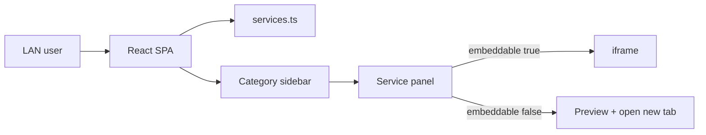

# Sola Management Hub (MVP) — React

## Overview

Ички экосистема хаб: барча сервис ва ҳисоботлар битта веб-саҳифада. Мокап: чап сайдбар (категориялар), ўнг панел (iframe ёки ташқи ҳавола). Auth/роли — кейинги босқич; MVP фақат LAN.

## Қарорлар

| Қарор | Танлов |
|-------|--------|
| Клик | iframe; блокланса — «Открыть в новой вкладке» |
| Auth | Йўқ (LAN only) |
| Стек | React + Vite + TypeScript (Laravelсиз) |
| Маълумот | `src/data/services.ts` статиқ каталог |

## Нега бу ечим

Муаммо — сервисларни бир жойда топиш, SSO эмас. Backendсиз SPA етарли; деплой `nginx` + `dist/`.

## Маълумот модели

Файл: `src/data/services.ts` — **ҳар бир URL алоҳида сайдбар банди** (11 та).

| # | Ном | URL |
|---|-----|-----|
| 1 | ERP | `http://erp.awg.lan/login.php` |
| 2 | StatisticWeb | `http://erp.awg.lan/StatisticWeb/main.php` |
| 3 | Jira | `https://it.sola.uz/jira/secure/Dashboard.jspa` |
| 4 | Portal 2022 | `http://portal-2022.sola.uz/dashboard` |
| 5 | Portal 2027 | `https://portal-2027.sola.uz` |
| 6 | Отчёты | `http://rep.awg.lan` |
| 7 | CRM | `https://solauzbekistan.amocrm.ru` |
| 8 | 172.18.0.241 | `https://172.18.0.241` |
| 9 | Real-time | `http://172.18.0.17/real-time/index` |
| 10 | Dealer | `https://dealer.sola.uz/login.php` |
| 11 | Почта | `https://mail.sola.uz` |

`embeddable`: LAN HTTP — `true`; HTTPS SaaS — `false`.

## UI

- Чап: тор сайдбар — иконка + лейбл; актив — soft blue.
- Ўнг: «Выбранная система» + ном + тавсиф; iframe ёки карточка.
- Бир категорияда бир неча сервис — таблар.

### Файллар

- `src/App.tsx`
- `src/components/Sidebar.tsx`
- `src/components/ServicePanel.tsx`
- `src/data/services.ts`
- `src/styles/`

Роутинг: `/`, `/:categorySlug`, `/:categorySlug/:serviceId`.

## Хавфсизлик

- Фақат ички тармоқ (firewall / VPN / LAN).
- URL фақат `services.ts` дан.
- Хабни HTTP ички хостда (`hub.awg.lan`) — mixed content олдини олиш.
- Деплой: `npm run build` → nginx `root` = `dist`.

## Кейинги босқич (ҳозир қилинмайди)

- Auth + роли
- Admin CRUD
- LDAP/AD

## Қабул критерийлари

- [ ] LAN дан очилади, логин йўқ
- [ ] Сайдбар категориялари ишлайди
- [ ] `embeddable=true` — iframe
- [ ] `embeddable=false` — «Открыть»
- [ ] Барча берилган URL лар каталогда
