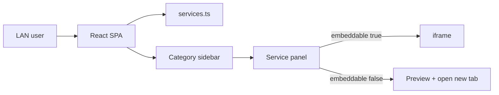

# Sola Management Hub (MVP) — React

## Overview

Ички экосистема хаб: барча сервис ва ҳисоботлар битта веб-саҳифада. Мокап: чап сайдбар (категориялар), ўнг панел (iframe ёки ташқи ҳавола). Auth/роли — кейинги босқич; MVP фақат LAN.

## Қарорлар

| Қарор | Танлов |
|-------|--------|
| Клик | iframe; блокланса — «Открыть в новой вкладке» |
| Auth | Йўқ (LAN only) |
| Стек | React + Vite + TypeScript (Laravelсиз) |
| Маълумот | `src/data/services.ts` статиқ каталог |

## Нега бу ечим

Муаммо — сервисларни бир жойда топиш, SSO эмас. Backendсиз SPA етарли; деплой `nginx` + `dist/`.

## Маълумот модели

`src/data/services.ts` — `CATEGORIES` + `SERVICES` (categoryId боғланиши).

Категориялар: CRM, ERP, Биллинг, Jira, Отчёты, Почта, База знаний (Lucide иконкалар).

Сервислар (11 URL): amoCRM, ERP login/stat, Dealer, Portal 2022/2027, Jira, AWG Reports, Node 241, Real-time, Sola Mail.

`embeddable`: LAN HTTP — `true`; HTTPS SaaS — `false`.

## UI

- Чап: тор сайдбар — иконка + лейбл; актив — soft blue.
- Ўнг: «Выбранная система» + ном + тавсиф; iframe ёки карточка.
- Бир категорияда бир неча сервис — таблар.

### Файллар

- `src/App.tsx`
- `src/components/Sidebar.tsx`
- `src/components/ServicePanel.tsx`
- `src/data/services.ts`
- `src/styles/`

Роутинг: `/`, `/:categorySlug`, `/:categorySlug/:serviceId`.

## Хавфсизлик

- Фақат ички тармоқ (firewall / VPN / LAN).
- URL фақат `services.ts` дан.
- Хабни HTTP ички хостда (`hub.awg.lan`) — mixed content олдини олиш.
- Деплой: `npm run build` → nginx `root` = `dist`.

## Кейинги босқич (ҳозир қилинмайди)

- Auth + роли
- Admin CRUD
- LDAP/AD

## Қабул критерийлари

- [ ] LAN дан очилади, логин йўқ
- [ ] Сайдбар категориялари ишлайди
- [ ] `embeddable=true` — iframe
- [ ] `embeddable=false` — «Открыть»
- [ ] Барча берилган URL лар каталогда
